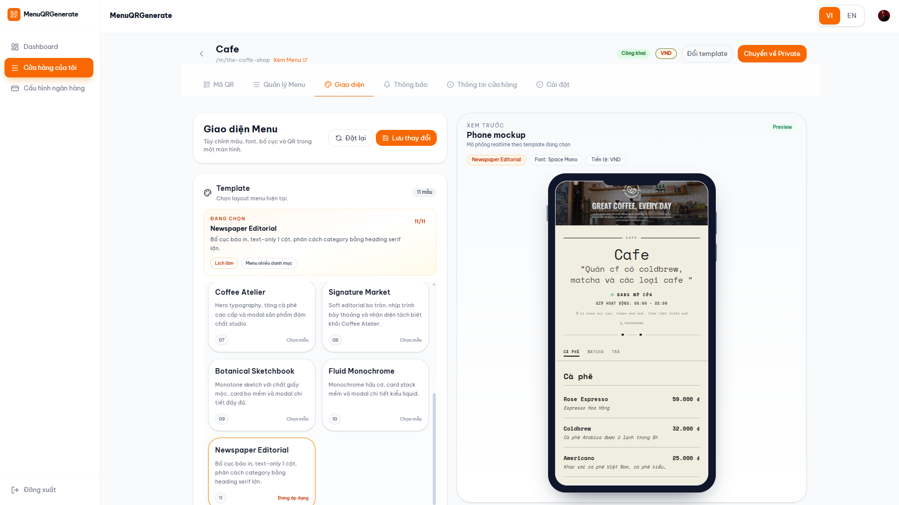
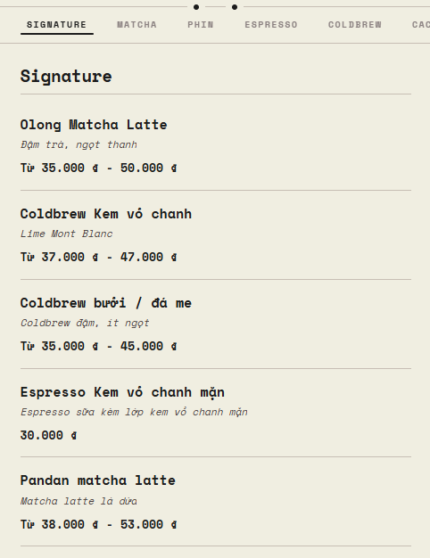
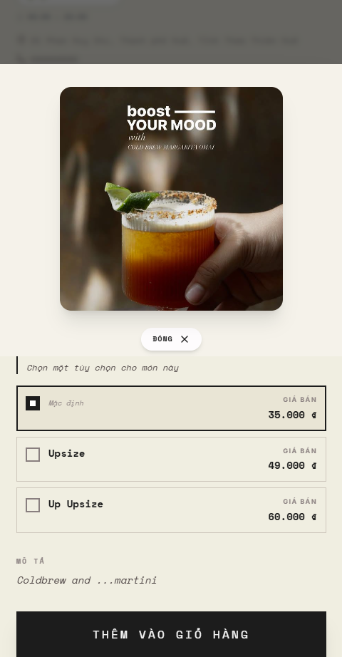
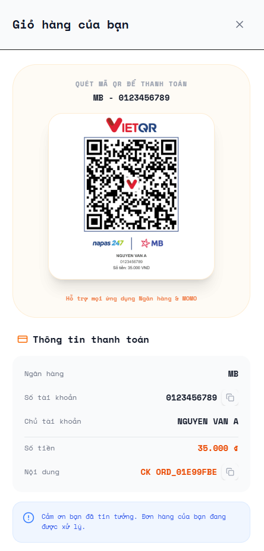
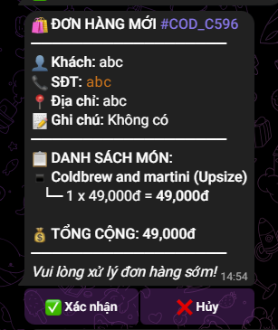

<!-- Portfolio README: English version -->

  
  
  

# Quang Thuan Dao — Software Engineer

> Production-grade backend · Reliable async pipelines · AI / OCR integrations

---

## About

- Skills: Production backend (FastAPI, NestJS), asynchronous pipelines (Celery, Azure Service Bus), AI/OCR workflows, frontend (React), and CI/CD/ops.
- Approach: Product-minded, reliability-first, measure impact and optimize operational cost.
- Note: Some enterprise projects are NDA-protected — technical summaries available after NDA.

---

## Core Skills

| Area | Highlights |
|---|---|
| Backend | FastAPI, NestJS, REST/GraphQL, SQL/NoSQL design |
| Async & Queue | Celery, Redis, Azure Service Bus — retry/backoff, idempotency |
| AI / Data | OCR pipelines, LLM post-processing, audio workflows |
| Frontend | React, Vite, Tailwind, client caching (IndexedDB) |
| DevOps | Docker, GitHub Actions, Netlify / Railway / Render, observability (Sentry) |
| Integrations | QR payments, Telegram, external APIs |

  
  
  
  
  

---

## Selected Projects

- 🔒 **Enterprise (NDA-protected)**
  - Role: Backend & system design, reliability engineering
  - Outcome: Implemented production-grade async pipelines and real-time event flows; hardened retry/idempotency to reduce failure modes and fixed regressions (race-conditions, message-size limits). Technical case-study available under NDA.

- 🧾 **QR Menu Generator (public)** — MVP+ product for digital menus and QR checkout
  - Checkout: BANK / COD + VietQR display
  - Notifications: Telegram order notifications
  - UX: Template/theme editor, mobile-first optimizations
  - Ops: Firestore client-side caching, CI/CD for FE & BE

---

### Demo screenshots — QR Menu

<table align="center">
  <tr>
    <td colspan="4">
      
    </td>
  </tr>
  <tr>
    <td align="center">
      
    </td>
    <td align="center">
      
    </td>
    <td align="center">
      
    </td>
    <td align="center">
      
    </td>
  </tr>
</table>

*_Note: Only screenshots are shown here. Live demo is available on request or after NDA._

## Contact

- ✉️ Email: qthuan1234@gmail.com
- 🔗 LinkedIn: https://linkedin.com/in/đào-quang-thuận-540414327

---

If you want a redacted technical case-study, screenshots/GIF demo, or help preparing a short portfolio deck, ping me — I can prepare them (NDA available for enterprise details).

Last updated: 2026-05-02
